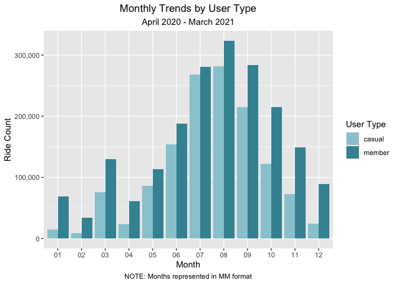
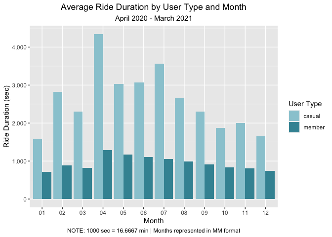

Cyclistic Bikesharing Case Study
================
A. Richmond-Parks
11/19/2021

## Data Prep

### Install and load necessary packages

``` r
install.packages("tidyverse", repos = "http://cran.us.r-project.org")
install.packages("DataExplorer", repos = "http://cran.us.r-project.org")
install.packages("janitor", repos = "http://cran.us.r-project.org")
install.packages("lubridate",repos = "http://cran.us.r-project.org")
```

### Load 12 months of bikesharing data

``` r
df1 <- read_csv("Desktop/Data Analytics Capstone/202004.csv", show_col_types = FALSE) # April 2020 
df2 <- read_csv("Desktop/Data Analytics Capstone/202005.csv", show_col_types = FALSE) # May 2020
df3 <- read_csv("Desktop/Data Analytics Capstone/202006.csv", show_col_types = FALSE) # June 2020
df4 <- read_csv("Desktop/Data Analytics Capstone/202007.csv", show_col_types = FALSE) # July 2020
df5 <- read_csv("Desktop/Data Analytics Capstone/202008.csv", show_col_types = FALSE) # August 2020
df6 <- read_csv("Desktop/Data Analytics Capstone/202009.csv", show_col_types = FALSE) # September 2020
df7 <- read_csv("Desktop/Data Analytics Capstone/202010.csv", show_col_types = FALSE) # October 2020
df8 <- read_csv("Desktop/Data Analytics Capstone/202011.csv", show_col_types = FALSE) # November 2020
df9 <- read_csv("Desktop/Data Analytics Capstone/202012.csv", show_col_types = FALSE) # December 2020
df10 <- read_csv("Desktop/Data Analytics Capstone/202101.csv", show_col_types = FALSE) # January 2021
df11 <- read_csv("Desktop/Data Analytics Capstone/202102.csv", show_col_types = FALSE) # February 2021
df12 <- read_csv("Desktop/Data Analytics Capstone/202103.csv", show_col_types = FALSE) # March 2021
```

### View data

``` r
glimpse(df1)
```

    ## Rows: 84,776
    ## Columns: 13
    ## $ ride_id            <chr> "A847FADBBC638E45", "5405B80E996FF60D", "5DD24A79A4…
    ## $ rideable_type      <chr> "docked_bike", "docked_bike", "docked_bike", "docke…
    ## $ started_at         <dttm> 2020-04-26 17:45:14, 2020-04-17 17:08:54, 2020-04-…
    ## $ ended_at           <dttm> 2020-04-26 18:12:03, 2020-04-17 17:17:03, 2020-04-…
    ## $ start_station_name <chr> "Eckhart Park", "Drake Ave & Fullerton Ave", "McClu…
    ## $ start_station_id   <dbl> 86, 503, 142, 216, 125, 173, 35, 434, 627, 377, 508…
    ## $ end_station_name   <chr> "Lincoln Ave & Diversey Pkwy", "Kosciuszko Park", "…
    ## $ end_station_id     <dbl> 152, 499, 255, 657, 323, 35, 635, 382, 359, 508, 37…
    ## $ start_lat          <dbl> 41.8964, 41.9244, 41.8945, 41.9030, 41.8902, 41.896…
    ## $ start_lng          <dbl> -87.6610, -87.7154, -87.6179, -87.6975, -87.6262, -…
    ## $ end_lat            <dbl> 41.9322, 41.9306, 41.8679, 41.8992, 41.9695, 41.892…
    ## $ end_lng            <dbl> -87.6586, -87.7238, -87.6230, -87.6722, -87.6547, -…
    ## $ member_casual      <chr> "member", "member", "member", "member", "casual", "…

``` r
glimpse(df2)
```

    ## Rows: 200,274
    ## Columns: 13
    ## $ ride_id            <chr> "02668AD35674B983", "7A50CCAF1EDDB28F", "2FFCDFDB91…
    ## $ rideable_type      <chr> "docked_bike", "docked_bike", "docked_bike", "docke…
    ## $ started_at         <dttm> 2020-05-27 10:03:52, 2020-05-25 10:47:11, 2020-05-…
    ## $ ended_at           <dttm> 2020-05-27 10:16:49, 2020-05-25 11:05:40, 2020-05-…
    ## $ start_station_name <chr> "Franklin St & Jackson Blvd", "Clark St & Wrightwoo…
    ## $ start_station_id   <dbl> 36, 340, 260, 251, 261, 206, 261, 180, 331, 219, 24…
    ## $ end_station_name   <chr> "Wabash Ave & Grand Ave", "Clark St & Leland Ave", …
    ## $ end_station_id     <dbl> 199, 326, 260, 157, 206, 22, 261, 180, 300, 305, 14…
    ## $ start_lat          <dbl> 41.8777, 41.9295, 41.9296, 41.9680, 41.8715, 41.847…
    ## $ start_lng          <dbl> -87.6353, -87.6431, -87.7079, -87.6500, -87.6699, -…
    ## $ end_lat            <dbl> 41.8915, 41.9671, 41.9296, 41.9367, 41.8472, 41.869…
    ## $ end_lng            <dbl> -87.6268, -87.6674, -87.7079, -87.6368, -87.6468, -…
    ## $ member_casual      <chr> "member", "casual", "casual", "casual", "member", "…

``` r
glimpse(df3)
```

    ## Rows: 343,005
    ## Columns: 13
    ## $ ride_id            <chr> "8CD5DE2C2B6C4CFC", "9A191EB2C751D85D", "F37D14B0B5…
    ## $ rideable_type      <chr> "docked_bike", "docked_bike", "docked_bike", "docke…
    ## $ started_at         <dttm> 2020-06-13 23:24:48, 2020-06-26 07:26:10, 2020-06-…
    ## $ ended_at           <dttm> 2020-06-13 23:36:55, 2020-06-26 07:31:58, 2020-06-…
    ## $ start_station_name <chr> "Wilton Ave & Belmont Ave", "Federal St & Polk St",…
    ## $ start_station_id   <dbl> 117, 41, 81, 303, 327, 327, 41, 115, 338, 84, 317, …
    ## $ end_station_name   <chr> "Damen Ave & Clybourn Ave", "Daley Center Plaza", "…
    ## $ end_station_id     <dbl> 163, 81, 5, 294, 117, 117, 81, 303, 164, 53, 168, 1…
    ## $ start_lat          <dbl> 41.94018, 41.87208, 41.88424, 41.94553, 41.92154, 4…
    ## $ start_lng          <dbl> -87.65304, -87.62954, -87.62963, -87.64644, -87.653…
    ## $ end_lat            <dbl> 41.93193, 41.88424, 41.87405, 41.97835, 41.94018, 4…
    ## $ end_lng            <dbl> -87.67786, -87.62963, -87.62772, -87.65975, -87.653…
    ## $ member_casual      <chr> "casual", "member", "member", "casual", "casual", "…

``` r
glimpse(df4)
```

    ## Rows: 551,480
    ## Columns: 13
    ## $ ride_id            <chr> "762198876D69004D", "BEC9C9FBA0D4CF1B", "D2FD8EA432…
    ## $ rideable_type      <chr> "docked_bike", "docked_bike", "docked_bike", "docke…
    ## $ started_at         <dttm> 2020-07-09 15:22:02, 2020-07-24 23:56:30, 2020-07-…
    ## $ ended_at           <dttm> 2020-07-09 15:25:52, 2020-07-25 00:20:17, 2020-07-…
    ## $ start_station_name <chr> "Ritchie Ct & Banks St", "Halsted St & Roscoe St", …
    ## $ start_station_id   <dbl> 180, 299, 329, 181, 268, 635, 113, 211, 176, 31, 14…
    ## $ end_station_name   <chr> "Wells St & Evergreen Ave", "Broadway & Ridge Ave",…
    ## $ end_station_id     <dbl> 291, 461, 156, 94, 301, 289, 140, 31, 191, 142, 31,…
    ## $ start_lat          <dbl> 41.90687, 41.94367, 41.93259, 41.89076, 41.91172, 4…
    ## $ start_lng          <dbl> -87.62622, -87.64895, -87.63643, -87.63170, -87.626…
    ## $ end_lat            <dbl> 41.90672, 41.98404, 41.93650, 41.91831, 41.90799, 4…
    ## $ end_lng            <dbl> -87.63483, -87.66027, -87.64754, -87.63628, -87.631…
    ## $ member_casual      <chr> "member", "member", "casual", "casual", "member", "…

``` r
glimpse(df5)
```

    ## Rows: 622,361
    ## Columns: 13
    ## $ ride_id            <chr> "322BD23D287743ED", "2A3AEF1AB9054D8B", "67DC1D133E…
    ## $ rideable_type      <chr> "docked_bike", "electric_bike", "electric_bike", "e…
    ## $ started_at         <dttm> 2020-08-20 18:08:14, 2020-08-27 18:46:04, 2020-08-…
    ## $ ended_at           <dttm> 2020-08-20 18:17:51, 2020-08-27 19:54:51, 2020-08-…
    ## $ start_station_name <chr> "Lake Shore Dr & Diversey Pkwy", "Michigan Ave & 14…
    ## $ start_station_id   <dbl> 329, 168, 195, 81, 658, 658, 196, 67, 153, 177, 313…
    ## $ end_station_name   <chr> "Clark St & Lincoln Ave", "Michigan Ave & 14th St",…
    ## $ end_station_id     <dbl> 141, 168, 44, 47, 658, 658, 49, 229, 225, 305, 296,…
    ## $ start_lat          <dbl> 41.93259, 41.86438, 41.88464, 41.88409, 41.90299, 4…
    ## $ start_lng          <dbl> -87.63643, -87.62368, -87.61955, -87.62964, -87.683…
    ## $ end_lat            <dbl> 41.91569, 41.86422, 41.88497, 41.88958, 41.90300, 4…
    ## $ end_lng            <dbl> -87.63460, -87.62344, -87.62757, -87.62754, -87.683…
    ## $ member_casual      <chr> "member", "casual", "casual", "casual", "casual", "…

``` r
glimpse(df6)
```

    ## Rows: 532,958
    ## Columns: 13
    ## $ ride_id            <chr> "2B22BD5F95FB2629", "A7FB70B4AFC6CAF2", "86057FA01B…
    ## $ rideable_type      <chr> "electric_bike", "electric_bike", "electric_bike", …
    ## $ started_at         <dttm> 2020-09-17 14:27:11, 2020-09-17 15:07:31, 2020-09-…
    ## $ ended_at           <dttm> 2020-09-17 14:44:24, 2020-09-17 15:07:45, 2020-09-…
    ## $ start_station_name <chr> "Michigan Ave & Lake St", "W Oakdale Ave & N Broadw…
    ## $ start_station_id   <dbl> 52, NA, NA, 246, 24, 94, 291, NA, NA, NA, 273, 145,…
    ## $ end_station_name   <chr> "Green St & Randolph St", "W Oakdale Ave & N Broadw…
    ## $ end_station_id     <dbl> 112, NA, NA, 249, 24, NA, 256, NA, NA, NA, 273, NA,…
    ## $ start_lat          <dbl> 41.88669, 41.94000, 41.94000, 41.95606, 41.89186, 4…
    ## $ start_lng          <dbl> -87.62356, -87.64000, -87.64000, -87.66892, -87.621…
    ## $ end_lat            <dbl> 41.88357, 41.94000, 41.94000, 41.96398, 41.89135, 4…
    ## $ end_lng            <dbl> -87.64873, -87.64000, -87.64000, -87.63822, -87.620…
    ## $ member_casual      <chr> "casual", "casual", "casual", "casual", "casual", "…

``` r
glimpse(df7)
```

    ## Rows: 388,653
    ## Columns: 13
    ## $ ride_id            <chr> "ACB6B40CF5B9044C", "DF450C72FD109C01", "B6396B54A1…
    ## $ rideable_type      <chr> "electric_bike", "electric_bike", "electric_bike", …
    ## $ started_at         <dttm> 2020-10-31 19:39:43, 2020-10-31 23:50:08, 2020-10-…
    ## $ ended_at           <dttm> 2020-10-31 19:57:12, 2020-11-01 00:04:16, 2020-10-…
    ## $ start_station_name <chr> "Lakeview Ave & Fullerton Pkwy", "Southport Ave & W…
    ## $ start_station_id   <dbl> 313, 227, 102, 165, 190, 359, 313, 125, NA, 174, 11…
    ## $ end_station_name   <chr> "Rush St & Hubbard St", "Kedzie Ave & Milwaukee Ave…
    ## $ end_station_id     <dbl> 125, 260, 423, 256, 185, 53, 125, 313, 199, 635, 30…
    ## $ start_lat          <dbl> 41.92610, 41.94817, 41.77346, 41.95085, 41.92886, 4…
    ## $ start_lng          <dbl> -87.63898, -87.66391, -87.58537, -87.65924, -87.663…
    ## $ end_lat            <dbl> 41.89035, 41.92953, 41.79145, 41.95281, 41.91778, 4…
    ## $ end_lng            <dbl> -87.62607, -87.70782, -87.60005, -87.65010, -87.691…
    ## $ member_casual      <chr> "casual", "casual", "casual", "casual", "casual", "…

``` r
glimpse(df8)
```

    ## Rows: 259,716
    ## Columns: 13
    ## $ ride_id            <chr> "BD0A6FF6FFF9B921", "96A7A7A4BDE4F82D", "C61526D065…
    ## $ rideable_type      <chr> "electric_bike", "electric_bike", "electric_bike", …
    ## $ started_at         <dttm> 2020-11-01 13:36:00, 2020-11-01 10:03:26, 2020-11-…
    ## $ ended_at           <dttm> 2020-11-01 13:45:40, 2020-11-01 10:14:45, 2020-11-…
    ## $ start_station_name <chr> "Dearborn St & Erie St", "Franklin St & Illinois St…
    ## $ start_station_id   <dbl> 110, 672, 76, 659, 2, 72, 76, NA, 58, 394, 623, NA,…
    ## $ end_station_name   <chr> "St. Clair St & Erie St", "Noble St & Milwaukee Ave…
    ## $ end_station_id     <dbl> 211, 29, 41, 185, 2, 76, 72, NA, 288, 273, 2, 506, …
    ## $ start_lat          <dbl> 41.89418, 41.89096, 41.88098, 41.89550, 41.87650, 4…
    ## $ start_lng          <dbl> -87.62913, -87.63534, -87.61675, -87.68201, -87.620…
    ## $ end_lat            <dbl> 41.89443, 41.90067, 41.87205, 41.91774, 41.87645, 4…
    ## $ end_lng            <dbl> -87.62338, -87.66248, -87.62955, -87.69139, -87.620…
    ## $ member_casual      <chr> "casual", "casual", "casual", "casual", "casual", "…

``` r
glimpse(df9)
```

    ## Rows: 131,573
    ## Columns: 13
    ## $ ride_id            <chr> "70B6A9A437D4C30D", "158A465D4E74C54A", "5262016E0F…
    ## $ rideable_type      <chr> "classic_bike", "electric_bike", "electric_bike", "…
    ## $ started_at         <dttm> 2020-12-27 12:44:29, 2020-12-18 17:37:15, 2020-12-…
    ## $ ended_at           <dttm> 2020-12-27 12:55:06, 2020-12-18 17:44:19, 2020-12-…
    ## $ start_station_name <chr> "Aberdeen St & Jackson Blvd", NA, NA, NA, NA, NA, N…
    ## $ start_station_id   <chr> "13157", NA, NA, NA, NA, NA, NA, NA, NA, NA, NA, NA…
    ## $ end_station_name   <chr> "Desplaines St & Kinzie St", NA, NA, NA, NA, NA, NA…
    ## $ end_station_id     <chr> "TA1306000003", NA, NA, NA, NA, NA, NA, NA, NA, NA,…
    ## $ start_lat          <dbl> 41.87773, 41.93000, 41.91000, 41.92000, 41.80000, 4…
    ## $ start_lng          <dbl> -87.65479, -87.70000, -87.69000, -87.70000, -87.590…
    ## $ end_lat            <dbl> 41.88872, 41.91000, 41.93000, 41.91000, 41.80000, 4…
    ## $ end_lng            <dbl> -87.64445, -87.70000, -87.70000, -87.70000, -87.590…
    ## $ member_casual      <chr> "member", "member", "member", "member", "member", "…

``` r
glimpse(df10)
```

    ## Rows: 96,834
    ## Columns: 13
    ## $ ride_id            <chr> "E19E6F1B8D4C42ED", "DC88F20C2C55F27F", "EC45C94683…
    ## $ rideable_type      <chr> "electric_bike", "electric_bike", "electric_bike", …
    ## $ started_at         <dttm> 2021-01-23 16:14:19, 2021-01-27 18:43:08, 2021-01-…
    ## $ ended_at           <dttm> 2021-01-23 16:24:44, 2021-01-27 18:47:12, 2021-01-…
    ## $ start_station_name <chr> "California Ave & Cortez St", "California Ave & Cor…
    ## $ start_station_id   <chr> "17660", "17660", "17660", "17660", "17660", "17660…
    ## $ end_station_name   <chr> NA, NA, NA, NA, NA, NA, NA, NA, NA, "Wood St & Augu…
    ## $ end_station_id     <chr> NA, NA, NA, NA, NA, NA, NA, NA, NA, "657", "13258",…
    ## $ start_lat          <dbl> 41.90034, 41.90033, 41.90031, 41.90040, 41.90033, 4…
    ## $ start_lng          <dbl> -87.69674, -87.69671, -87.69664, -87.69666, -87.696…
    ## $ end_lat            <dbl> 41.89000, 41.90000, 41.90000, 41.92000, 41.90000, 4…
    ## $ end_lng            <dbl> -87.72000, -87.69000, -87.70000, -87.69000, -87.700…
    ## $ member_casual      <chr> "member", "member", "member", "member", "casual", "…

``` r
glimpse(df11)
```

    ## Rows: 49,622
    ## Columns: 13
    ## $ ride_id            <chr> "89E7AA6C29227EFF", "0FEFDE2603568365", "E6159D746B…
    ## $ rideable_type      <chr> "classic_bike", "classic_bike", "electric_bike", "c…
    ## $ started_at         <dttm> 2021-02-12 16:14:56, 2021-02-14 17:52:38, 2021-02-…
    ## $ ended_at           <dttm> 2021-02-12 16:21:43, 2021-02-14 18:12:09, 2021-02-…
    ## $ start_station_name <chr> "Glenwood Ave & Touhy Ave", "Glenwood Ave & Touhy A…
    ## $ start_station_id   <chr> "525", "525", "KA1503000012", "637", "13216", "1800…
    ## $ end_station_name   <chr> "Sheridan Rd & Columbia Ave", "Bosworth Ave & Howar…
    ## $ end_station_id     <chr> "660", "16806", "TA1305000029", "TA1305000034", "TA…
    ## $ start_lat          <dbl> 42.01270, 42.01270, 41.88579, 41.89563, 41.83473, 4…
    ## $ start_lng          <dbl> -87.66606, -87.66606, -87.63110, -87.67207, -87.625…
    ## $ end_lat            <dbl> 42.00458, 42.01954, 41.88487, 41.90312, 41.83816, 4…
    ## $ end_lng            <dbl> -87.66141, -87.66956, -87.62750, -87.67394, -87.645…
    ## $ member_casual      <chr> "member", "casual", "member", "member", "member", "…

``` r
glimpse(df12)
```

    ## Rows: 228,496
    ## Columns: 13
    ## $ ride_id            <chr> "CFA86D4455AA1030", "30D9DC61227D1AF3", "846D87A156…
    ## $ rideable_type      <chr> "classic_bike", "classic_bike", "classic_bike", "cl…
    ## $ started_at         <dttm> 2021-03-16 08:32:30, 2021-03-28 01:26:28, 2021-03-…
    ## $ ended_at           <dttm> 2021-03-16 08:36:34, 2021-03-28 01:36:55, 2021-03-…
    ## $ start_station_name <chr> "Humboldt Blvd & Armitage Ave", "Humboldt Blvd & Ar…
    ## $ start_station_id   <chr> "15651", "15651", "15443", "TA1308000021", "525", "…
    ## $ end_station_name   <chr> "Stave St & Armitage Ave", "Central Park Ave & Bloo…
    ## $ end_station_id     <chr> "13266", "18017", "TA1308000043", "13323", "E008", …
    ## $ start_lat          <dbl> 41.91751, 41.91751, 41.84273, 41.96881, 42.01270, 4…
    ## $ start_lng          <dbl> -87.70181, -87.70181, -87.63549, -87.65766, -87.666…
    ## $ end_lat            <dbl> 41.91774, 41.91417, 41.83066, 41.95283, 42.05049, 4…
    ## $ end_lng            <dbl> -87.69139, -87.71676, -87.64717, -87.64999, -87.677…
    ## $ member_casual      <chr> "casual", "casual", "casual", "casual", "casual", "…

### Combine CSVs into a single file and use DataExplorer for advanced data exploration

``` r
all_trips <- rbind(df1,df2,df3,df4,df5,df6,df7,df8,df9,df10,df11,df12)
create_report(all_trips)
```

    ## 
    ## 
    ## processing file: report.rmd

    ## output file: /Users/arielrp/report.knit.md

    ## 
    ## Output created: report.html

### Remove empty columns and rows

``` r
all_trips <- janitor::remove_empty(all_trips, which = c("cols"))
all_trips <- janitor::remove_empty(all_trips, which = c("rows"))
```

### Create columns as follows: date, month, day, year, weekday, start_hour, end_hour, and season

``` r
all_trips$date <- as.Date(all_trips$started_at) 
all_trips$month <- format(as.Date(all_trips$date), "%m")
all_trips$day <- format(as.Date(all_trips$date), "%d")
all_trips$year <- format(as.Date(all_trips$date), "%Y")
all_trips$weekday <- format(as.Date(all_trips$date), "%A")
all_trips$start_hour = format(as.POSIXct(all_trips$started_at), "%H")
all_trips$end_hour = format(as.POSIXct(all_trips$ended_at), "%H")
all_trips$season <- ifelse (all_trips$month %in% c('06','07','08'), "Summer",
                    ifelse (all_trips$month %in% c('09','10','11'), "Fall",
                    ifelse (all_trips$month %in% c('12','01','02'), "Winter",
                    ifelse (all_trips$month %in% c('03','04','05'), "Spring", NA))))
```

### Calculate ride length and create new column

``` r
all_trips$ride_length <- difftime(all_trips$ended_at,all_trips$started_at)
```

### View the structure of all_trips

``` r
str(all_trips)
```

    ## tibble [3,489,748 × 22] (S3: tbl_df/tbl/data.frame)
    ##  $ ride_id           : chr [1:3489748] "A847FADBBC638E45" "5405B80E996FF60D" "5DD24A79A4E006F4" "2A59BBDF5CDBA725" ...
    ##  $ rideable_type     : chr [1:3489748] "docked_bike" "docked_bike" "docked_bike" "docked_bike" ...
    ##  $ started_at        : POSIXct[1:3489748], format: "2020-04-26 17:45:14" "2020-04-17 17:08:54" ...
    ##  $ ended_at          : POSIXct[1:3489748], format: "2020-04-26 18:12:03" "2020-04-17 17:17:03" ...
    ##  $ start_station_name: chr [1:3489748] "Eckhart Park" "Drake Ave & Fullerton Ave" "McClurg Ct & Erie St" "California Ave & Division St" ...
    ##  $ start_station_id  : chr [1:3489748] "86" "503" "142" "216" ...
    ##  $ end_station_name  : chr [1:3489748] "Lincoln Ave & Diversey Pkwy" "Kosciuszko Park" "Indiana Ave & Roosevelt Rd" "Wood St & Augusta Blvd" ...
    ##  $ end_station_id    : chr [1:3489748] "152" "499" "255" "657" ...
    ##  $ start_lat         : num [1:3489748] 41.9 41.9 41.9 41.9 41.9 ...
    ##  $ start_lng         : num [1:3489748] -87.7 -87.7 -87.6 -87.7 -87.6 ...
    ##  $ end_lat           : num [1:3489748] 41.9 41.9 41.9 41.9 42 ...
    ##  $ end_lng           : num [1:3489748] -87.7 -87.7 -87.6 -87.7 -87.7 ...
    ##  $ member_casual     : chr [1:3489748] "member" "member" "member" "member" ...
    ##  $ date              : Date[1:3489748], format: "2020-04-26" "2020-04-17" ...
    ##  $ month             : chr [1:3489748] "04" "04" "04" "04" ...
    ##  $ day               : chr [1:3489748] "26" "17" "01" "07" ...
    ##  $ year              : chr [1:3489748] "2020" "2020" "2020" "2020" ...
    ##  $ weekday           : chr [1:3489748] "Sunday" "Friday" "Wednesday" "Tuesday" ...
    ##  $ start_hour        : chr [1:3489748] "17" "17" "17" "12" ...
    ##  $ end_hour          : chr [1:3489748] "18" "17" "18" "13" ...
    ##  $ season            : chr [1:3489748] "Spring" "Spring" "Spring" "Spring" ...
    ##  $ ride_length       : 'difftime' num [1:3489748] 1609 489 863 732 ...
    ##   ..- attr(*, "units")= chr "secs"

### Check the data type for ride_length and change it to numeric

``` r
is.factor(all_trips$ride_length) 
```

    ## [1] FALSE

``` r
all_trips$ride_length <- as.numeric(as.character(all_trips$ride_length)) 
is.numeric(all_trips$ride_length)
```

    ## [1] TRUE

### Omit NAs, negative trip lengths, and maintenance checks

``` r
all_trips <- na.omit(all_trips)
all_trips_v2 <- all_trips[!(all_trips$start_station_name == "HQ QR"| all_trips$start_station_name == "CHECK" | all_trips$start_station_name == "TEST" | all_trips$start_station_name == "DIVVY" |
all_trips$start_station_name == "" |
all_trips$ride_length < 0),]
```

## Initial Data Analysis

### Summary statistics for ride_length

``` r
summary(all_trips_v2$ride_length)
```

    ##    Min. 1st Qu.  Median    Mean 3rd Qu.    Max. 
    ##       0     485     885    1683    1615 3523202

### Summary statistics for member and casual usage

``` r
aggregate(all_trips_v2$ride_length ~ all_trips_v2$member_casual, FUN = mean)
```

    ##   all_trips_v2$member_casual all_trips_v2$ride_length
    ## 1                     casual                 2727.148
    ## 2                     member                  955.989

``` r
aggregate(all_trips_v2$ride_length ~ all_trips_v2$member_casual, FUN = median)
```

    ##   all_trips_v2$member_casual all_trips_v2$ride_length
    ## 1                     casual                     1298
    ## 2                     member                      696

``` r
aggregate(all_trips_v2$ride_length ~ all_trips_v2$member_casual, FUN = max)
```

    ##   all_trips_v2$member_casual all_trips_v2$ride_length
    ## 1                     casual                  3341033
    ## 2                     member                  3523202

``` r
aggregate(all_trips_v2$ride_length ~ all_trips_v2$member_casual, FUN = min)
```

    ##   all_trips_v2$member_casual all_trips_v2$ride_length
    ## 1                     casual                        0
    ## 2                     member                        0

### Set levels for weekdays

``` r
all_trips_v2$weekday <- ordered(all_trips_v2$weekday, levels=c("Sunday", "Monday", "Tuesday", "Wednesday", "Thursday", "Friday", "Saturday"))
```

## Weekday Trends

### Average duration by user type and weekday

``` r
all_trips_v2 %>%
  group_by(member_casual, weekday) %>% 
  summarise(number_of_rides = n() 
            ,average_duration = mean(ride_length)) %>% 
  arrange(member_casual, weekday)
```

    ## # A tibble: 14 × 4
    ## # Groups:   member_casual [2]
    ##    member_casual weekday   number_of_rides average_duration
    ##    <chr>         <ord>               <int>            <dbl>
    ##  1 casual        Sunday             249761            3068.
    ##  2 casual        Monday             142042            2729.
    ##  3 casual        Tuesday            136218            2456.
    ##  4 casual        Wednesday          148352            2453.
    ##  5 casual        Thursday           156177            2616.
    ##  6 casual        Friday             196451            2595.
    ##  7 casual        Saturday           319017            2838.
    ##  8 member        Sunday             250465            1089.
    ##  9 member        Monday             251905             906.
    ## 10 member        Tuesday            268223             898.
    ## 11 member        Wednesday          288390             903.
    ## 12 member        Thursday           283731             902.
    ## 13 member        Friday             288897             934.
    ## 14 member        Saturday           304608            1061.

### Ridership by weekday and user type

``` r
all_trips_v2$weekday<- ordered(all_trips_v2$weekday, levels=c("Sunday", "Monday", "Tuesday", "Wednesday", "Thursday", "Friday", "Saturday"))

ggplot(all_trips_v2, aes(x = weekday, fill = member_casual)) +
  geom_bar(position = "dodge") +
  ggtitle('Daily Ridership by User Type', subtitle = "April 2020 - March 2021") + 
  theme(plot.title = element_text(hjust = 0.5), plot.subtitle = element_text(hjust = 0.5)) +    
  xlab('Weekday') + ylab('Ride Count') + 
  labs(fill='User Type') +
  scale_y_continuous(labels = scales::comma) +
scale_fill_manual(values = c("#99cad5", "#3f93a2"),
                     labels = c("casual","member"))
```

<!-- -->

### Average ride duration by user type and weekday

``` r
all_trips_v2 %>%
  group_by(member_casual, weekday) %>%
  summarise(number_of_rides = n()
            ,average_duration = mean(ride_length)) %>%
  arrange(member_casual, weekday) %>%
  ggplot(aes(x = weekday, y = average_duration, fill = member_casual)) +
  geom_col(position = "dodge") +
  ggtitle('Average Ride Duration by User Type and Weekday', subtitle = "April 2020 - March 2021") + 
  theme(plot.title = element_text(hjust = 0.5), plot.subtitle = element_text(hjust = 0.5), plot.caption = element_text(hjust = 0.5)) +  
  xlab('Weekday') + ylab('Ride Duration (sec)') + 
  labs(fill='User Type') +
  labs(caption = "NOTE: 1000 sec = 16.6667 min") +
  scale_y_continuous(labels = scales::comma) +
  scale_fill_manual(values = c("#99cad5", "#3f93a2"),
                     labels = c("casual","member"))
```

<!-- -->

## Ride Type Trends

### Count of ride type by user type

``` r
all_trips_v2 %>% count(rideable_type, member_casual)
```

    ## # A tibble: 6 × 3
    ##   rideable_type member_casual       n
    ##   <chr>         <chr>           <int>
    ## 1 classic_bike  casual          70432
    ## 2 classic_bike  member         248181
    ## 3 docked_bike   casual        1111448
    ## 4 docked_bike   member        1432527
    ## 5 electric_bike casual         166138
    ## 6 electric_bike member         255511

``` r
ggplot(all_trips_v2, aes(x = rideable_type, fill = member_casual)) + 
    geom_bar(position = "dodge") +
    ggtitle('Ride Type by User Type', subtitle = "April 2020 - March 2021") + 
    theme(plot.title = element_text(hjust = 0.5), plot.subtitle = element_text(hjust = 0.5)) +  
    xlab('Ride Type') +     ylab('Ride Count') + 
    labs(fill='User Type') +
    scale_y_continuous(labels = scales::comma) +
  scale_fill_manual(values = c("#99cad5", "#3f93a2"),
                     labels = c("casual","member"))
```

<!-- -->

## Seasonal Trends

### Seasonal trends by user type

``` r
all_trips_v2 %>% count(season, member_casual)
```

    ## # A tibble: 8 × 3
    ##   season member_casual      n
    ##   <chr>  <chr>          <int>
    ## 1 Fall   casual        409859
    ## 2 Fall   member        647739
    ## 3 Spring casual        185910
    ## 4 Spring member        304187
    ## 5 Summer casual        704454
    ## 6 Summer member        792042
    ## 7 Winter casual         47795
    ## 8 Winter member        192251

``` r
ggplot(all_trips_v2, aes(x = season, fill = member_casual)) +
  geom_bar(position = "dodge") +
  ggtitle('Seasonal Trends by User Type', subtitle = "April 2020 - March 2021") + 
  theme(plot.title = element_text(hjust = 0.5), plot.subtitle = element_text(hjust = 0.5)) +    
  xlab('Season') +  ylab('Ride Count') + 
  labs(fill='User Type') +
  scale_y_continuous(labels = scales::comma) +
  scale_fill_manual(values = c("#99cad5", "#3f93a2"),
                     labels = c("casual","member"))
```

<!-- -->

### Average ride duration by user type and season

``` r
seasonal_avg_duration <- all_trips_v2 %>%
  group_by(member_casual, season) %>%
  summarise(number_of_rides = n(),
            average_duration = mean(ride_length)) %>%
  arrange(member_casual, season) 

print(seasonal_avg_duration)
```

    ## # A tibble: 8 × 4
    ## # Groups:   member_casual [2]
    ##   member_casual season number_of_rides average_duration
    ##   <chr>         <chr>            <int>            <dbl>
    ## 1 casual        Fall            409859            2125.
    ## 2 casual        Spring          185910            2907.
    ## 3 casual        Summer          704454            3090.
    ## 4 casual        Winter           47795            1845.
    ## 5 member        Fall            647739             865.
    ## 6 member        Spring          304187            1045.
    ## 7 member        Summer          792042            1044.
    ## 8 member        Winter          192251             760.

``` r
ggplot(seasonal_avg_duration, aes(x = season, y = average_duration, fill = member_casual)) +
  geom_col(position = "dodge") +
  ggtitle('Average Ride Duration by User Type and Season', subtitle = "April 2020 - March 2021") + 
  theme(plot.title = element_text(hjust = 0.5), plot.subtitle = element_text(hjust = 0.5), plot.caption = element_text(hjust = 0.5)) + 
  xlab('Season') + ylab('Ride Duration (sec)') + 
  labs(fill='User Type') +
  labs(caption = "NOTE: 1000 sec = 16.6667 min") +
  scale_y_continuous(labels = scales::comma) +
  scale_fill_manual(values = c("#99cad5", "#3f93a2"),
                     labels = c("casual","member"))
```

<!-- -->

## Monthly Trends

### Monthly trends by user type

``` r
monthly_usercount <- all_trips_v2 %>% count(month, member_casual)

print(monthly_usercount, n=24) 
```

    ## # A tibble: 24 × 3
    ##    month member_casual      n
    ##    <chr> <chr>          <int>
    ##  1 01    casual         14690
    ##  2 01    member         68819
    ##  3 02    casual          8613
    ##  4 02    member         34383
    ##  5 03    casual         75641
    ##  6 03    member        130048
    ##  7 04    casual         23570
    ##  8 04    member         61056
    ##  9 05    casual         86699
    ## 10 05    member        113083
    ## 11 06    casual        154342
    ## 12 06    member        187727
    ## 13 07    casual        268125
    ## 14 07    member        280556
    ## 15 08    casual        281987
    ## 16 08    member        323759
    ## 17 09    casual        214681
    ## 18 09    member        283582
    ## 19 10    casual        122328
    ## 20 10    member        215072
    ## 21 11    casual         72850
    ## 22 11    member        149085
    ## 23 12    casual         24492
    ## 24 12    member         89049

``` r
ggplot(all_trips_v2, aes(x = month, fill = member_casual)) +
  geom_bar(position = "dodge") +
  ggtitle('Monthly Trends by User Type', subtitle = "April 2020 - March 2021") + 
  theme(plot.title = element_text(hjust = 0.5), plot.subtitle = element_text(hjust = 0.5), plot.caption = element_text(hjust = 0.5)) +  
  xlab('Month') +   ylab('Ride Count') + 
  labs(fill='User Type') +
  labs(caption = "NOTE: Months represented in MM format") +
  scale_y_continuous(labels = scales::comma) +
  scale_fill_manual(values = c("#99cad5", "#3f93a2"),
                     labels = c("casual","member"))
```

<!-- -->

### Average ride duration by user type and month

``` r
avg_duration <- all_trips_v2 %>%
  group_by(member_casual, month) %>%
  summarise(number_of_rides = n(),
            average_duration = mean(ride_length)) %>%
  arrange(member_casual, month) 

print(avg_duration, n=24)
```

    ## # A tibble: 24 × 4
    ## # Groups:   member_casual [2]
    ##    member_casual month number_of_rides average_duration
    ##    <chr>         <chr>           <int>            <dbl>
    ##  1 casual        01              14690            1582.
    ##  2 casual        02               8613            2828.
    ##  3 casual        03              75641            2309.
    ##  4 casual        04              23570            4349.
    ##  5 casual        05              86699            3036.
    ##  6 casual        06             154342            3074.
    ##  7 casual        07             268125            3557.
    ##  8 casual        08             281987            2655.
    ##  9 casual        09             214681            2305.
    ## 10 casual        10             122328            1878.
    ## 11 casual        11              72850            2009.
    ## 12 casual        12              24492            1657.
    ## 13 member        01              68819             722.
    ## 14 member        02              34383             887.
    ## 15 member        03             130048             820.
    ## 16 member        04              61056            1282.
    ## 17 member        05             113083            1175.
    ## 18 member        06             187727            1112.
    ## 19 member        07             280556            1054.
    ## 20 member        08             323759             994.
    ## 21 member        09             283582             917.
    ## 22 member        10             215072             836.
    ## 23 member        11             149085             809.
    ## 24 member        12              89049             741.

``` r
ggplot(avg_duration, aes(x = month, y = average_duration, fill = member_casual)) +
geom_col(position = "dodge") + ggtitle('Average Ride Duration by User Type and Month', subtitle = "April 2020 - March 2021") + theme(plot.title = element_text(hjust = 0.5), plot.subtitle = element_text(hjust = 0.5), plot.caption = element_text(hjust = 0.5)) + xlab('Month') + ylab('Ride Duration (sec)') + labs(fill='User Type') + labs(caption = "NOTE: 1000 sec = 16.6667 min | Months represented in MM format") + scale_y_continuous(labels = scales::comma) +
    scale_fill_manual(values = c("#99cad5", "#3f93a2"),
                     labels = c("casual","member"))
```

<!-- -->

## Hourly Trends

### Popular start hours by user type

``` r
pop_start_hour <- all_trips_v2 %>% count(start_hour, member_casual, sort = TRUE)

casual_start_hour <- filter(pop_start_hour, member_casual == 'casual')

casual_start_hour <- casual_start_hour %>% 
  arrange(desc(n)) %>% 
  slice_head(n=10)

print(casual_start_hour)
```

    ## # A tibble: 10 × 3
    ##    start_hour member_casual      n
    ##    <chr>      <chr>          <int>
    ##  1 17         casual        132735
    ##  2 18         casual        120115
    ##  3 16         casual        119366
    ##  4 15         casual        112562
    ##  5 14         casual        106951
    ##  6 13         casual        100794
    ##  7 12         casual         92724
    ##  8 19         casual         91953
    ##  9 11         casual         76235
    ## 10 20         casual         64384

``` r
member_start_hour <- filter(pop_start_hour, member_casual == 'member')

member_start_hour <- member_start_hour %>%
arrange(desc(n)) %>% 
  slice_head(n=10)

print(member_start_hour)
```

    ## # A tibble: 10 × 3
    ##    start_hour member_casual      n
    ##    <chr>      <chr>          <int>
    ##  1 17         member        204592
    ##  2 18         member        177828
    ##  3 16         member        170650
    ##  4 15         member        141869
    ##  5 12         member        128265
    ##  6 13         member        127446
    ##  7 14         member        127421
    ##  8 19         member        123248
    ##  9 11         member        109004
    ## 10 08         member         98003

### Start hour trends by user type

``` r
ggplot(all_trips_v2, aes(x = start_hour, fill = member_casual)) +
  geom_bar(position = "dodge") + 
  ggtitle('Start Hour Trends by User Type', subtitle = "April 2020 - March 2021") + 
  theme(plot.title = element_text(hjust = 0.5), plot.subtitle = element_text(hjust = 0.5), plot.caption = element_text(hjust = 0.5)) +  
  xlab('Start Hour (Military Time)') +  ylab('Ride Count') + 
  labs(fill='User Type') +
  labs(caption = 'NOTE: 0000 / 2400 = 12 a.m.') +
  scale_fill_manual(values = c("#99cad5", "#3f93a2"),
                    labels = c("casual","member"))
```

<!-- -->

### Popular start hours - Casuals

``` r
ggplot(casual_start_hour, aes(x = start_hour, y = n)) + 
  geom_bar(stat = "identity", fill="#99cad5", colour="black") +
  ggtitle('Top 10 Start Hours - Casuals', subtitle = "April 2020 - March 2021") + 
  theme(plot.title = element_text(hjust = 0.5), plot.subtitle = element_text(hjust = 0.5)) +    
  xlab('Start Hour (Military Time)') + ylab('Ride Count') +
  scale_y_continuous(labels = scales::comma) 
```

<!-- -->

### Popular start hours - Members

``` r
ggplot(data = member_start_hour, aes(x = start_hour, y = n)) + 
  geom_bar(stat = "identity", fill="#3f93a2", colour="black") +
  ggtitle('Top 10 Start Hours - Members', subtitle = "April 2020 - March 2021") + 
  theme(plot.title = element_text(hjust = 0.5), plot.subtitle = element_text(hjust = 0.5)) +    
  xlab('Start Hour (Military Time)') + ylab('Ride Count') +
  scale_y_continuous(labels = scales::comma) 
```

<!-- -->

### Popular end hours by user type

``` r
pop_end_hour <- all_trips_v2 %>% count(end_hour, member_casual, sort = TRUE) 

print(pop_end_hour, n=48)
```

    ## # A tibble: 48 × 3
    ##    end_hour member_casual      n
    ##    <chr>    <chr>          <int>
    ##  1 17       member        198958
    ##  2 18       member        188076
    ##  3 16       member        162417
    ##  4 15       member        137853
    ##  5 19       member        136707
    ##  6 17       casual        131154
    ##  7 18       casual        128183
    ##  8 13       member        126870
    ##  9 14       member        126494
    ## 10 12       member        125557
    ## 11 16       casual        118067
    ## 12 15       casual        110372
    ## 13 19       casual        104569
    ## 14 11       member        101795
    ## 15 14       casual        100980
    ## 16 08       member         99574
    ## 17 13       casual         93519
    ## 18 20       member         87339
    ## 19 09       member         84153
    ## 20 10       member         83663
    ## 21 12       casual         83267
    ## 22 07       member         82495
    ## 23 20       casual         78629
    ## 24 11       casual         62892
    ## 25 21       casual         55301
    ## 26 21       member         51373
    ## 27 06       member         44590
    ## 28 22       casual         44439
    ## 29 10       casual         43910
    ## 30 23       casual         37291
    ## 31 22       member         33891
    ## 32 09       casual         32281
    ## 33 08       casual         26940
    ## 34 00       casual         26191
    ## 35 23       member         23636
    ## 36 07       casual         18204
    ## 37 01       casual         17385
    ## 38 05       member         12749
    ## 39 00       member         12513
    ## 40 02       casual         10509
    ## 41 06       casual          9811
    ## 42 01       member          6917
    ## 43 03       casual          6115
    ## 44 05       casual          4039
    ## 45 04       casual          3970
    ## 46 02       member          3688
    ## 47 04       member          2760
    ## 48 03       member          2151

``` r
member_end_hour <- filter(pop_end_hour, member_casual == 'member', sort = TRUE) 
member_end_hour <- member_end_hour %>%
  arrange(desc(n)) %>% 
  slice_head(n=10)

print(member_end_hour)
```

    ## # A tibble: 10 × 3
    ##    end_hour member_casual      n
    ##    <chr>    <chr>          <int>
    ##  1 17       member        198958
    ##  2 18       member        188076
    ##  3 16       member        162417
    ##  4 15       member        137853
    ##  5 19       member        136707
    ##  6 13       member        126870
    ##  7 14       member        126494
    ##  8 12       member        125557
    ##  9 11       member        101795
    ## 10 08       member         99574

``` r
casual_end_hour <- filter(pop_end_hour, member_casual == 'casual', sort = TRUE) 
casual_end_hour <- casual_end_hour %>%
  arrange(desc(n)) %>% 
  slice_head(n=10)

print(casual_end_hour)
```

    ## # A tibble: 10 × 3
    ##    end_hour member_casual      n
    ##    <chr>    <chr>          <int>
    ##  1 17       casual        131154
    ##  2 18       casual        128183
    ##  3 16       casual        118067
    ##  4 15       casual        110372
    ##  5 19       casual        104569
    ##  6 14       casual        100980
    ##  7 13       casual         93519
    ##  8 12       casual         83267
    ##  9 20       casual         78629
    ## 10 11       casual         62892

### End hour trends by user type

``` r
ggplot(all_trips_v2, aes(x = end_hour, fill = member_casual)) +
  geom_bar(position = "dodge") + 
  ggtitle('End Hour Trends by User Type', subtitle = "April 2020 - March 2021") + 
  theme(plot.title = element_text(hjust = 0.5), plot.subtitle = element_text(hjust = 0.5), plot.caption = element_text(hjust = 0.5)) +  
  xlab('End Hour (Military Time)') +    ylab('Ride Count') + 
  labs(fill='User Type') +
  labs(caption = 'NOTE: 0000 / 2400 = 12 a.m.') +
    scale_fill_manual(values = c("#99cad5", "#3f93a2"),
                     labels = c("casual","member"))
```

<!-- -->

### Popular end hours - Casuals

``` r
ggplot(casual_end_hour, aes(x = end_hour, y = n)) + 
  geom_bar(stat = "identity", fill="#99cad5", colour="black") +
  ggtitle('Top 10 End Hours - Casuals', subtitle = "April 2020 - March 2021") + 
  theme(plot.title = element_text(hjust = 0.5), plot.subtitle = element_text(hjust = 0.5)) +    
  xlab('End Hour (Military Time)') + ylab('Ride Count') +
  scale_y_continuous(labels = scales::comma) 
```

<!-- -->

### Popular end hours - Members

``` r
ggplot(data = member_end_hour, aes(x = end_hour, y = n)) + 
  geom_bar(stat = "identity", fill="#3f93a2", colour="black") +
  ggtitle('Top 10 End Hours - Members', subtitle = "April 2020 - March 2021") + 
  theme(plot.title = element_text(hjust = 0.5), plot.subtitle = element_text(hjust = 0.5)) +    
  xlab('End Hour (Military Time)') + ylab('Ride Count') +
  scale_y_continuous(labels = scales::comma) 
```

<!-- -->

## Station Trends

### Popular start stations by user type

``` r
popular_stations <- all_trips_v2 %>% count(start_station_name, member_casual)

print(popular_stations)
```

    ## # A tibble: 1,383 × 3
    ##    start_station_name         member_casual     n
    ##    <chr>                      <chr>         <int>
    ##  1 2112 W Peterson Ave        casual          311
    ##  2 2112 W Peterson Ave        member          550
    ##  3 63rd St Beach              casual         1580
    ##  4 63rd St Beach              member          889
    ##  5 900 W Harrison St          casual         1319
    ##  6 900 W Harrison St          member         2517
    ##  7 Aberdeen St & Jackson Blvd casual         2313
    ##  8 Aberdeen St & Jackson Blvd member         6097
    ##  9 Aberdeen St & Monroe St    casual         1726
    ## 10 Aberdeen St & Monroe St    member         4573
    ## # … with 1,373 more rows

### Popular end stations by user type

``` r
end_stations <- all_trips_v2 %>% count(end_station_name, member_casual)

print(end_stations)
```

    ## # A tibble: 1,396 × 3
    ##    end_station_name           member_casual     n
    ##    <chr>                      <chr>         <int>
    ##  1 2112 W Peterson Ave        casual          315
    ##  2 2112 W Peterson Ave        member          653
    ##  3 63rd St Beach              casual         1521
    ##  4 63rd St Beach              member          963
    ##  5 900 W Harrison St          casual         1250
    ##  6 900 W Harrison St          member         2515
    ##  7 Aberdeen St & Jackson Blvd casual         2269
    ##  8 Aberdeen St & Jackson Blvd member         6009
    ##  9 Aberdeen St & Monroe St    casual         1664
    ## 10 Aberdeen St & Monroe St    member         4852
    ## # … with 1,386 more rows

### Top 10 start stations - Casuals

``` r
pop_stations_casual<- filter(popular_stations, member_casual == 'casual')

pop_stations_casual <- pop_stations_casual %>% 
  arrange(desc(n)) %>% 
  slice_head(n=10)

print(pop_stations_casual)
```

    ## # A tibble: 10 × 3
    ##    start_station_name           member_casual     n
    ##    <chr>                        <chr>         <int>
    ##  1 Streeter Dr & Grand Ave      casual        25975
    ##  2 Lake Shore Dr & Monroe St    casual        20469
    ##  3 Millennium Park              casual        19236
    ##  4 Theater on the Lake          casual        14837
    ##  5 Indiana Ave & Roosevelt Rd   casual        13488
    ##  6 Michigan Ave & Oak St        casual        13482
    ##  7 Lake Shore Dr & North Blvd   casual        13197
    ##  8 Clark St & Elm St            casual        11819
    ##  9 Michigan Ave & Lake St       casual        11589
    ## 10 Michigan Ave & Washington St casual        10566

``` r
ggplot(data = pop_stations_casual, aes(x = start_station_name, y = n)) + 
  geom_bar(stat = "identity", fill="#99cad5", colour="black") +
  ggtitle('Top 10 Start Stations - Casuals', subtitle = "April 2020 - March 2021") + 
  theme(plot.title = element_text(hjust = 0.5), plot.subtitle = element_text(hjust = 0.5)) +    
  xlab('Station Name') + ylab('Ride Count') + 
  coord_flip( )
```

<!-- -->

### Top 10 start stations - Members

``` r
pop_stations_member<- filter(popular_stations, member_casual == 'member')

pop_stations_member <- pop_stations_member %>% 
  arrange(desc(n)) %>% 
  slice_head(n=10)

print(pop_stations_member)
```

    ## # A tibble: 10 × 3
    ##    start_station_name       member_casual     n
    ##    <chr>                    <chr>         <int>
    ##  1 Clark St & Elm St        member        20005
    ##  2 Broadway & Barry Ave     member        15541
    ##  3 St. Clair St & Erie St   member        15174
    ##  4 Dearborn St & Erie St    member        15069
    ##  5 Wells St & Concord Ln    member        14836
    ##  6 Theater on the Lake      member        14516
    ##  7 Kingsbury St & Kinzie St member        14049
    ##  8 Wells St & Huron St      member        13864
    ##  9 Wells St & Elm St        member        13815
    ## 10 Clark St & Armitage Ave  member        13717

``` r
ggplot(data = pop_stations_member, aes(x = start_station_name, y = n)) + 
  geom_bar(stat = "identity", fill="#3f93a2", colour="black") +
  ggtitle('Top 10 Start Stations - Members', subtitle = "April 2020 - March 2021") + 
  theme(plot.title = element_text(hjust = 0.5), plot.subtitle = element_text(hjust = 0.5)) +    
  xlab('Station Name') + ylab('Ride Count') + 
  coord_flip( )
```

<!-- -->

### Top 10 end stations - Casuals

``` r
end_stations_casual<- filter(end_stations, member_casual == 'casual') 

end_stations_casual <- end_stations_casual %>% 
  arrange(desc(n)) %>% 
  slice_head(n=10)

print(end_stations_casual)
```

    ## # A tibble: 10 × 3
    ##    end_station_name             member_casual     n
    ##    <chr>                        <chr>         <int>
    ##  1 Streeter Dr & Grand Ave      casual        28320
    ##  2 Millennium Park              casual        20094
    ##  3 Lake Shore Dr & Monroe St    casual        20022
    ##  4 Theater on the Lake          casual        16701
    ##  5 Lake Shore Dr & North Blvd   casual        14202
    ##  6 Michigan Ave & Oak St        casual        14071
    ##  7 Indiana Ave & Roosevelt Rd   casual        13608
    ##  8 Clark St & Elm St            casual        11262
    ##  9 Michigan Ave & Lake St       casual        11116
    ## 10 Michigan Ave & Washington St casual        10554

``` r
ggplot(data = end_stations_casual, aes(x = end_station_name, y = n)) + 
  geom_bar(stat = "identity", fill="#99cad5", colour="black") +
  ggtitle('Top 10 End Stations - Casuals', subtitle = "April 2020 - March 2021") + 
  theme(plot.title = element_text(hjust = 0.5), plot.subtitle = element_text(hjust = 0.5)) +    
  xlab('Station Name') + ylab('Ride Count') + 
  coord_flip( )
```

<!-- -->

### Top 10 end stations - Members

``` r
end_stations_member <- filter(end_stations, member_casual == 'member')

end_stations_member <- end_stations_member %>%
  arrange(desc(n)) %>% 
  slice_head(n=10)

print(end_stations_member)
```

    ## # A tibble: 10 × 3
    ##    end_station_name           member_casual     n
    ##    <chr>                      <chr>         <int>
    ##  1 Clark St & Elm St          member        20502
    ##  2 St. Clair St & Erie St     member        16343
    ##  3 Broadway & Barry Ave       member        15770
    ##  4 Dearborn St & Erie St      member        15695
    ##  5 Wells St & Concord Ln      member        15326
    ##  6 Theater on the Lake        member        14274
    ##  7 Kingsbury St & Kinzie St   member        14247
    ##  8 Lake Shore Dr & North Blvd member        13147
    ##  9 Wells St & Elm St          member        13088
    ## 10 Wabash Ave & Roosevelt Rd  member        13074

``` r
ggplot(data = end_stations_member, aes(x = end_station_name, y = n)) + 
  geom_bar(stat = "identity", fill="#3f93a2", colour="black") +
  ggtitle('Top 10 End Stations - Members', subtitle = "April 2020 - March 2021") + 
  theme(plot.title = element_text(hjust = 0.5), plot.subtitle = element_text(hjust = 0.5)) +    
  xlab('Station Name') + ylab('Ride Count') + 
  coord_flip( )
```

<!-- -->
